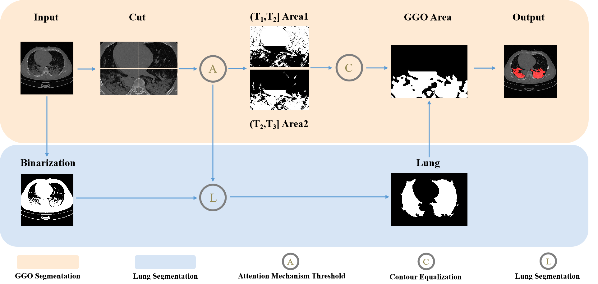
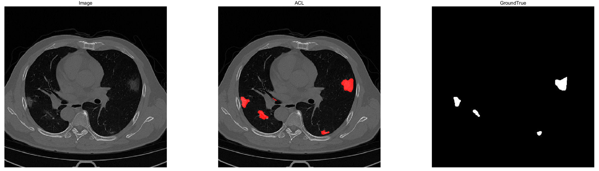
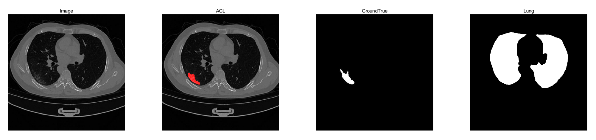

### COVID-19 CT Ground-Glass Opacity Segmentation Based on Attention Mechanism Threshold

------

### Introduction

------



#### COVID-19 CT Ground-Glass Opacity Segmentation Based on Attention Mechanism Threshold

Yunbo Rao , Qingsong Lv , Shaoning Zeng∗ , Yuling Yi , Cheng Huang , Yun Gao , Zhanglin Cheng , Jihong Sun, 2022

### What we are doing

- [x] GGO Segmentation
- [x] Lung cavity segmentation
- [x] Provide a collated dataset of 311 slices

### Preparation

------

First of all, clone the code and prepare Matlab2020a software

```bash
git clone git@github.com:Lqs-github/ACL.git
```

and then Run *ACL.m* file.

Finally, you can see the GGO segmentation results for 840 slices and the GroundTrue.



------

### Other

If you want to see the result of the segmentation of the **lung cavity**, replace lines **245 - 253** in the ***ACL.m*** file with the following code.



```matlab
subplot(141)
imshow(image);
title('Image')
subplot(142)
imshow(ill_image);
title('ACL')
subplot(143)
imshow(gt);
title('GroundTrue');
subplot(144)
imshow(lung);
title('Lung');
```

